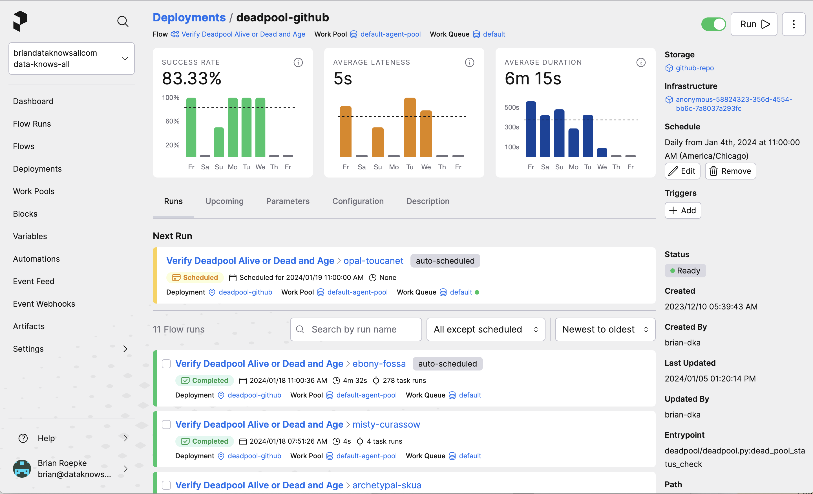

# Prefect Workflow Orchestration

[Prefect](https://www.prefect.io) is an open-source **orchestration** tool for data engineering. It is a Python-based tool that allows you to **define**, **schedule**, and **monitor** your data pipelines. Prefect is a great tool for data engineers and data scientists who want to automate their **data pipelines**. 

In this project I have a collection of utilities for running prefect along with various *Flows*, or workflows. There are utilities for working with:

- Snowflake
- Slack
- Twilio
- Wikipedia

And more.  
 

